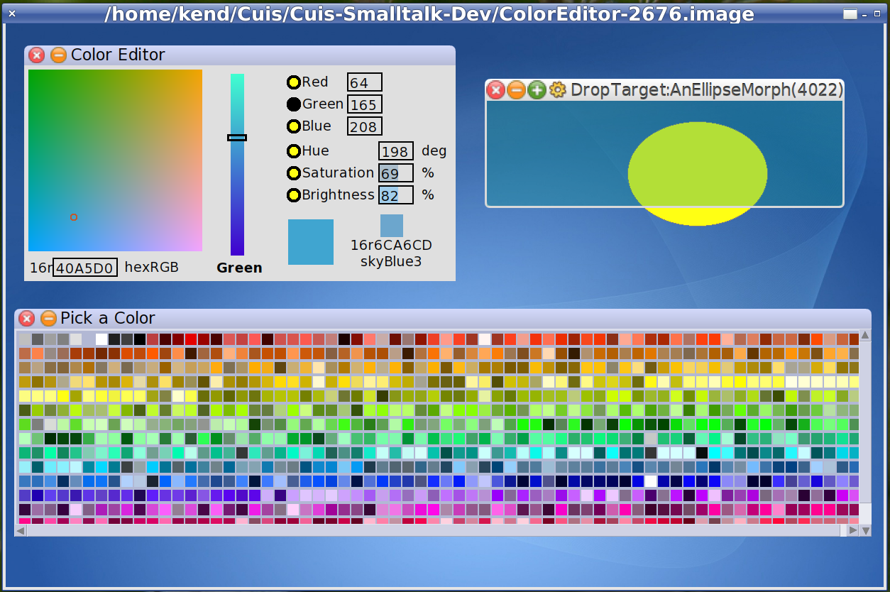

Cuis-Smalltalk-ColorEditor
==========================
Tested in Cuis 4.2  rev 2972

Requires packages Cuis-Smalltalk-NamedColors and Cuis-Smalltalk-Morphic-Misc1.

To load the package
````Smalltalk
	Feature require: #'Morphic-ColorEditor'.
````

Color Editor/Picker  RGB/HSV with closest CSS3 color

  World Menu -> New Morph -> ColorEditor -> ColorEditorPanel
  
  World Menu -> New Morph -> ColorEditor -> ColorPallet

Select a morph via left-click and use morph menu to "show drop target for me"

Drag color from color pallet or circle in color editor's color plane & drop onto drop target.


You can change the color dictionary.

````Smalltalk
	ColorPallet useCrayonColorDict.
	ColorPallet useXKCDColorDict.
	ColorPallet useNBSISCCColorDict.
	ColorPallet useCSS3ColorDict.
````


